# BLE 陀螺仪协议：时序图、状态图、异常处理与术语表

> 配套文档：《BLE提取与陀螺仪自定义协议指导文档》
> 本文档用 Mermaid 描述关键操作时序、主机与协议解析器状态机、异常处理流程，并给出术语名词解释。
> 所有图与协议帧定义、参考实现代码（`docs/reference/`）保持一致。

---

## 目录

1. [关键操作时序图](#1-关键操作时序图)
2. [状态图](#2-状态图)
3. [异常处理流程](#3-异常处理流程)
4. [术语名词解释](#4-术语名词解释)

---

## 1. 关键操作时序图

### 1.1 扫描、连接与服务准备

覆盖：绑定服务 → `connectGatt` → 连接成功 → 服务发现 → 定位特征值 → 使能通知 → 就绪。

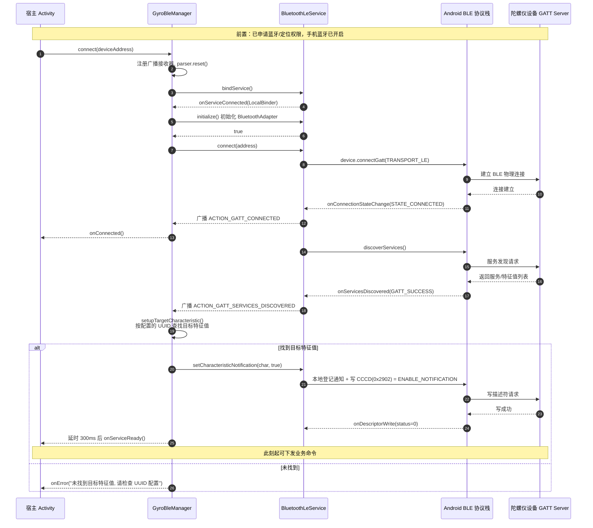
```mermaid
sequenceDiagram
    autonumber
    participant UI as 宿主 Activity
    participant MGR as GyroBleManager
    participant SVC as BluetoothLeService
    participant OS as Android BLE 协议栈
    participant DEV as 陀螺仪设备 GATT Server

    Note over UI,DEV: 前置：已申请蓝牙/定位权限，手机蓝牙已开启
    UI->>MGR: connect(deviceAddress)
    MGR->>MGR: 注册广播接收器, parser.reset()
    MGR->>SVC: bindService()
    SVC-->>MGR: onServiceConnected(LocalBinder)
    MGR->>SVC: initialize() 初始化 BluetoothAdapter
    SVC-->>MGR: true
    MGR->>SVC: connect(address)
    SVC->>OS: device.connectGatt(TRANSPORT_LE)
    OS->>DEV: 建立 BLE 物理连接
    DEV-->>OS: 连接建立
    OS-->>SVC: onConnectionStateChange(STATE_CONNECTED)
    SVC-->>MGR: 广播 ACTION_GATT_CONNECTED
    MGR-->>UI: onConnected()
    SVC->>OS: discoverServices()
    OS->>DEV: 服务发现请求
    DEV-->>OS: 返回服务/特征值列表
    OS-->>SVC: onServicesDiscovered(GATT_SUCCESS)
    SVC-->>MGR: 广播 ACTION_GATT_SERVICES_DISCOVERED
    MGR->>MGR: setupTargetCharacteristic()<br/>按配置的 UUID 查找目标特征值
    alt 找到目标特征值
        MGR->>SVC: setCharacteristicNotification(char, true)
        SVC->>OS: 本地登记通知 + 写 CCCD(0x2902) = ENABLE_NOTIFICATION
        OS->>DEV: 写描述符请求
        DEV-->>OS: 写成功
        OS-->>SVC: onDescriptorWrite(status=0)
        MGR-->>UI: 延时 300ms 后 onServiceReady()
        Note over UI,DEV: 此刻起可下发业务命令
    else 未找到
        MGR-->>UI: onError("未找到目标特征值, 请检查 UUID 配置")
    end
```

### 1.2 命令发送内部流程（以"寻北"为例）

覆盖：组帧 → 分包 → 写队列 → 发送线程串行写入（等待每包写回调）。

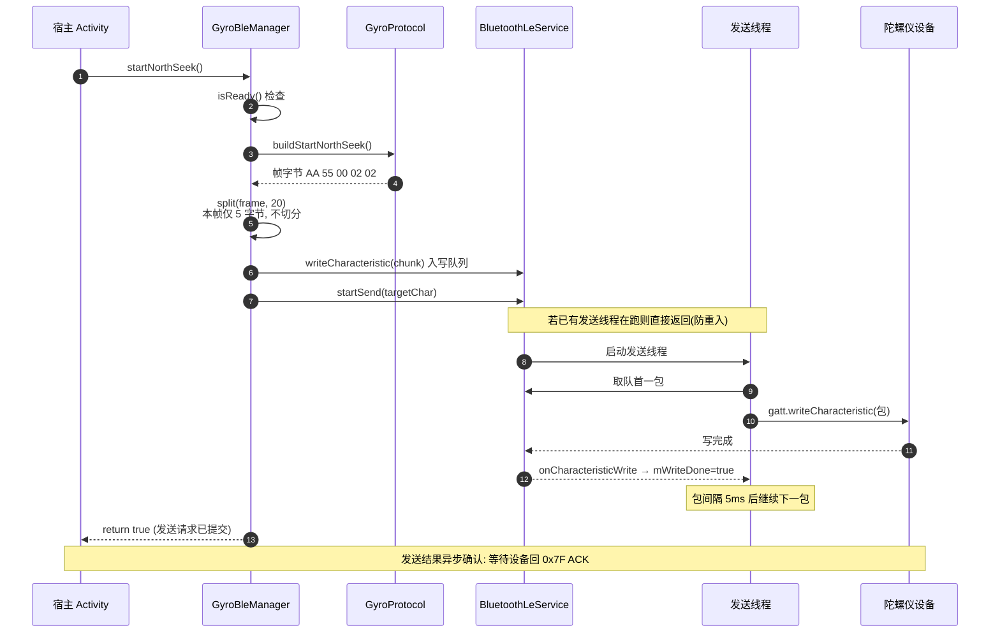
```mermaid
sequenceDiagram
    autonumber
    participant UI as 宿主 Activity
    participant MGR as GyroBleManager
    participant PROTO as GyroProtocol
    participant SVC as BluetoothLeService
    participant TH as 发送线程
    participant DEV as 陀螺仪设备

    UI->>MGR: startNorthSeek()
    MGR->>MGR: isReady() 检查
    MGR->>PROTO: buildStartNorthSeek()
    PROTO-->>MGR: 帧字节 AA 55 00 02 02
    MGR->>MGR: split(frame, 20)<br/>本帧仅 5 字节, 不切分
    MGR->>SVC: writeCharacteristic(chunk) 入写队列
    MGR->>SVC: startSend(targetChar)
    Note over SVC,TH: 若已有发送线程在跑则直接返回(防重入)
    SVC->>TH: 启动发送线程
    TH->>SVC: 取队首一包
    TH->>DEV: gatt.writeCharacteristic(包)
    DEV-->>SVC: 写完成
    SVC-->>TH: onCharacteristicWrite → mWriteDone=true
    Note over TH: 包间隔 5ms 后继续下一包
    MGR-->>UI: return true (发送请求已提交)
    Note over UI,DEV: 发送结果异步确认: 等待设备回 0x7F ACK
```

### 1.3 完整业务交互（设置纬度 → 寻北 → 导航 → 退出）

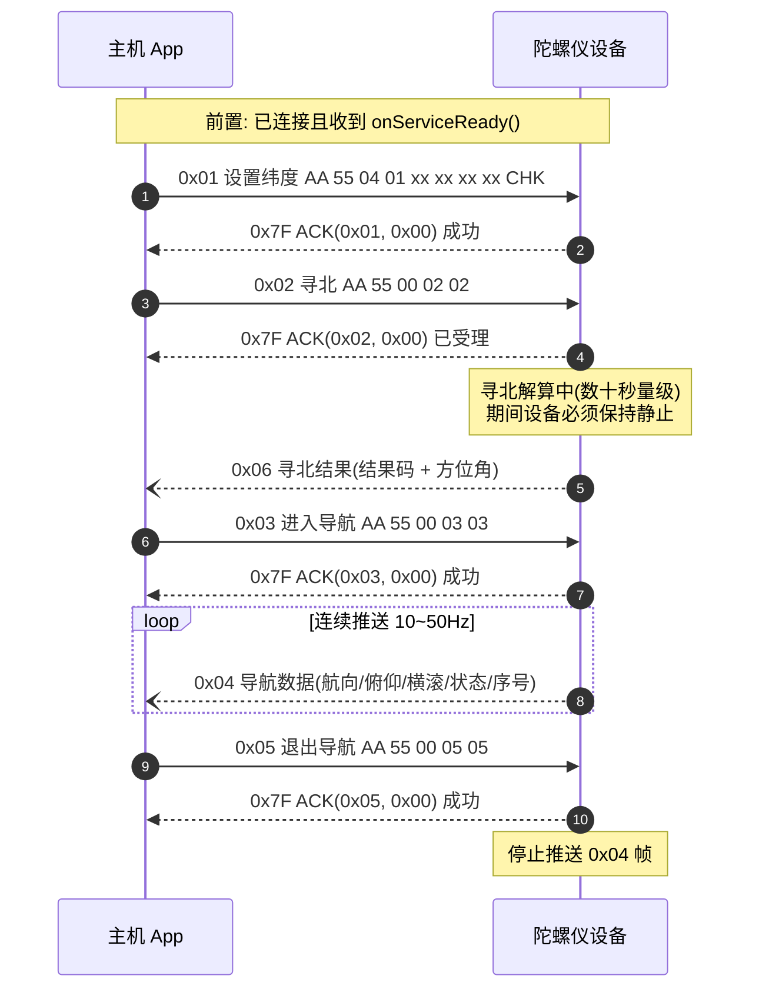
```mermaid
sequenceDiagram
    autonumber
    participant UI as 主机 App
    participant DEV as 陀螺仪设备

    Note over UI,DEV: 前置: 已连接且收到 onServiceReady()
    UI->>DEV: 0x01 设置纬度 AA 55 04 01 xx xx xx xx CHK
    DEV-->>UI: 0x7F ACK(0x01, 0x00) 成功
    UI->>DEV: 0x02 寻北 AA 55 00 02 02
    DEV-->>UI: 0x7F ACK(0x02, 0x00) 已受理
    Note over DEV: 寻北解算中(数十秒量级)<br/>期间设备必须保持静止
    DEV--)UI: 0x06 寻北结果(结果码 + 方位角)
    UI->>DEV: 0x03 进入导航 AA 55 00 03 03
    DEV-->>UI: 0x7F ACK(0x03, 0x00) 成功
    loop 连续推送 10~50Hz
        DEV--)UI: 0x04 导航数据(航向/俯仰/横滚/状态/序号)
    end
    UI->>DEV: 0x05 退出导航 AA 55 00 05 05
    DEV-->>UI: 0x7F ACK(0x05, 0x00) 成功
    Note over DEV: 停止推送 0x04 帧
```

### 1.4 接收与解帧流程（连续导航数据为例）

覆盖：通知到达 → 广播 → 流式解帧 → 按命令分发到主线程回调。

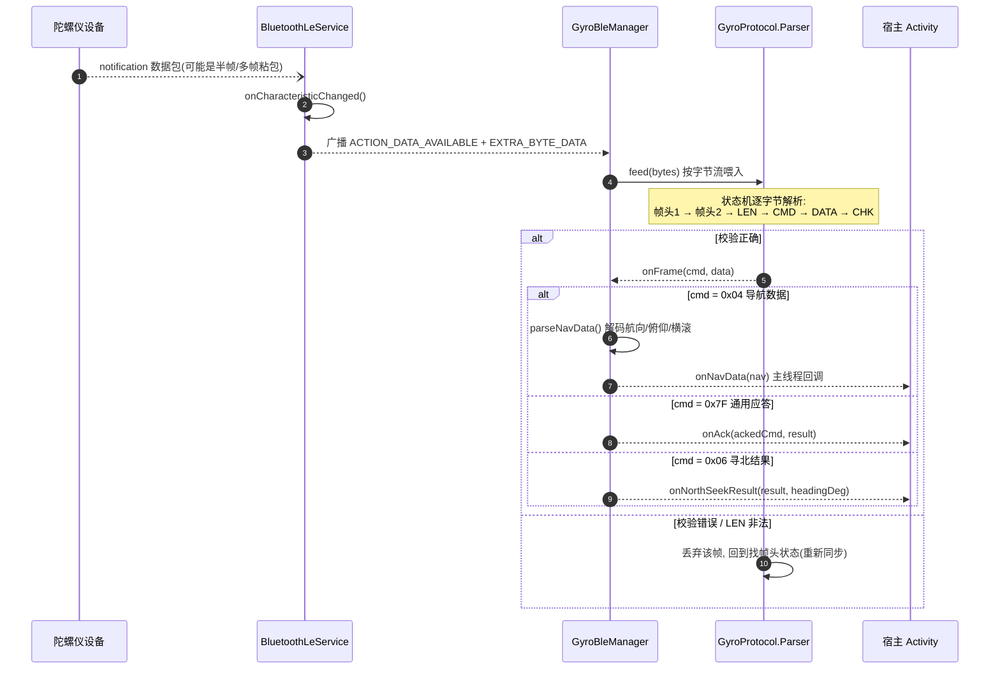
```mermaid
sequenceDiagram
    autonumber
    participant DEV as 陀螺仪设备
    participant SVC as BluetoothLeService
    participant MGR as GyroBleManager
    participant PARSE as GyroProtocol.Parser
    participant UI as 宿主 Activity

    DEV--)SVC: notification 数据包(可能是半帧/多帧粘包)
    SVC->>SVC: onCharacteristicChanged()
    SVC-->>MGR: 广播 ACTION_DATA_AVAILABLE + EXTRA_BYTE_DATA
    MGR->>PARSE: feed(bytes) 按字节流喂入
    Note over PARSE: 状态机逐字节解析:<br/>帧头1 → 帧头2 → LEN → CMD → DATA → CHK
    alt 校验正确
        PARSE-->>MGR: onFrame(cmd, data)
        alt cmd = 0x04 导航数据
            MGR->>MGR: parseNavData() 解码航向/俯仰/横滚
            MGR-->>UI: onNavData(nav) 主线程回调
        else cmd = 0x7F 通用应答
            MGR-->>UI: onAck(ackedCmd, result)
        else cmd = 0x06 寻北结果
            MGR-->>UI: onNorthSeekResult(result, headingDeg)
        end
    else 校验错误 / LEN 非法
        PARSE->>PARSE: 丢弃该帧, 回到找帧头状态(重新同步)
    end
```

### 1.5 断开连接与资源释放

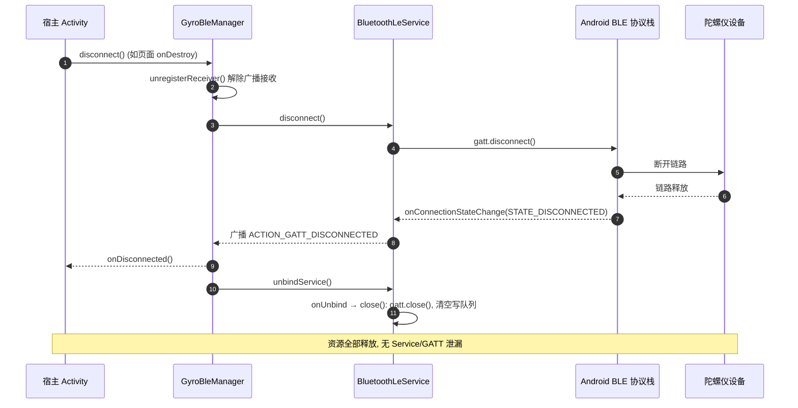
```mermaid
sequenceDiagram
    autonumber
    participant UI as 宿主 Activity
    participant MGR as GyroBleManager
    participant SVC as BluetoothLeService
    participant OS as Android BLE 协议栈
    participant DEV as 陀螺仪设备

    UI->>MGR: disconnect() (如页面 onDestroy)
    MGR->>MGR: unregisterReceiver() 解除广播接收
    MGR->>SVC: disconnect()
    SVC->>OS: gatt.disconnect()
    OS->>DEV: 断开链路
    DEV-->>OS: 链路释放
    OS-->>SVC: onConnectionStateChange(STATE_DISCONNECTED)
    SVC-->>MGR: 广播 ACTION_GATT_DISCONNECTED
    MGR-->>UI: onDisconnected()
    MGR->>SVC: unbindService()
    SVC->>SVC: onUnbind → close(): gatt.close(), 清空写队列
    Note over UI,DEV: 资源全部释放, 无 Service/GATT 泄漏
```

### 1.6 连接成功后的设置纬度操作（单命令完整往返）

参与者按调用链精简为 5 个：宿主 Activity、GyroBleManager、FrameListener、GyroProtocol、Parser。
蓝牙链路层的收发由 BluetoothLeService 承担，此处以注释带过（细节见 §1.1 / §1.2）。

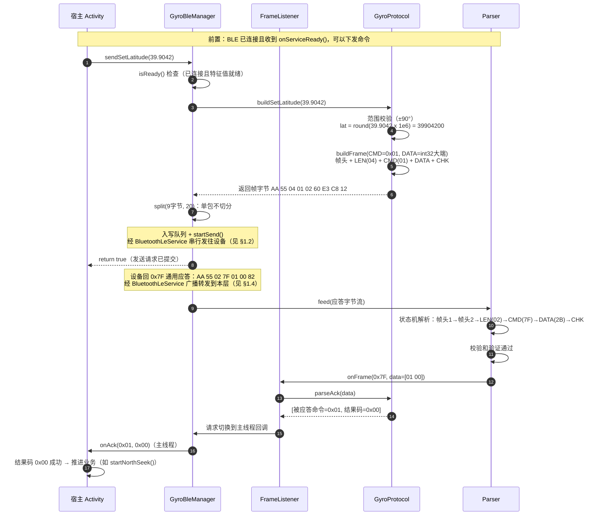
```mermaid
sequenceDiagram
    autonumber
    participant UI as 宿主 Activity
    participant MGR as GyroBleManager
    participant FL as FrameListener
    participant PROTO as GyroProtocol
    participant PARSE as Parser

    Note over UI,PARSE: 前置：BLE 已连接且收到 onServiceReady()，可以下发命令

    UI->>MGR: sendSetLatitude(39.9042)
    MGR->>MGR: isReady() 检查（已连接且特征值就绪）
    MGR->>PROTO: buildSetLatitude(39.9042)
    PROTO->>PROTO: 范围校验（±90°）<br/>lat = round(39.9042 x 1e6) = 39904200
    PROTO->>PROTO: buildFrame(CMD=0x01, DATA=int32大端)<br/>帧头 + LEN(04) + CMD(01) + DATA + CHK
    PROTO-->>MGR: 返回帧字节 AA 55 04 01 02 60 E3 C8 12
    MGR->>MGR: split(9字节, 20)：单包不切分
    Note over MGR: 入写队列 + startSend()<br/>经 BluetoothLeService 串行发往设备（见 §1.2）
    MGR-->>UI: return true（发送请求已提交）

    Note over MGR: 设备回 0x7F 通用应答：AA 55 02 7F 01 00 82<br/>经 BluetoothLeService 广播转发到本层（见 §1.4）

    MGR->>PARSE: feed(应答字节流)
    PARSE->>PARSE: 状态机解析：帧头1→帧头2→LEN(02)→CMD(7F)→DATA(2B)→CHK
    PARSE->>PARSE: 校验和验证通过
    PARSE->>FL: onFrame(0x7F, data=[01 00])
    FL->>PROTO: parseAck(data)
    PROTO-->>FL: [被应答命令=0x01, 结果码=0x00]
    FL->>MGR: 请求切换到主线程回调
    MGR->>UI: onAck(0x01, 0x00)（主线程）
    UI->>UI: 结果码 0x00 成功 → 推进业务（如 startNorthSeek()）
```

> 图中字节数与协议定义一致：设置纬度帧 `AA 55 04 01 ...` 中 LEN=04 表示 DATA 为 4 字节；
> 应答帧 `AA 55 02 7F 01 00 82` 中 LEN=02 表示 DATA 为 2 字节（被应答命令 + 结果码）。

### 1.7 连接成功后的寻北操作（命令应答 + 异步结果上报）

参与者共 7 个：宿主 Activity、GyroBleManager、FrameListener、GyroProtocol、Parser、
BroadcastReceiver、BluetoothLeService。与 §1.6 相比，本图展开了"通知 → 广播 → 接收器 → 解帧"
的完整接收链路。设备不在参与者之列，链路收发以注释表示。

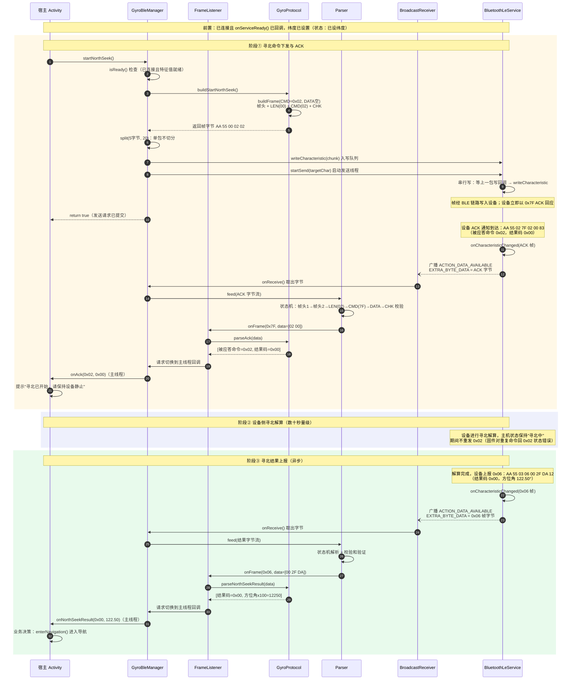
```mermaid
sequenceDiagram
    autonumber
    participant UI as 宿主 Activity
    participant MGR as GyroBleManager
    participant FL as FrameListener
    participant PROTO as GyroProtocol
    participant PARSE as Parser
    participant BR as BroadcastReceiver
    participant SVC as BluetoothLeService

    Note over UI,SVC: 前置：已连接且 onServiceReady() 已回调，纬度已设置（状态：已设纬度）

    rect rgb(255, 248, 231)
    Note over UI,SVC: 阶段① 寻北命令下发与 ACK
    UI->>MGR: startNorthSeek()
    MGR->>MGR: isReady() 检查（已连接且特征值就绪）
    MGR->>PROTO: buildStartNorthSeek()
    PROTO->>PROTO: buildFrame(CMD=0x02, DATA空)<br/>帧头 + LEN(00) + CMD(02) + CHK
    PROTO-->>MGR: 返回帧字节 AA 55 00 02 02
    MGR->>MGR: split(5字节, 20)：单包不切分
    MGR->>SVC: writeCharacteristic(chunk) 入写队列
    MGR->>SVC: startSend(targetChar) 启动发送线程
    SVC->>SVC: 串行写：等上一包写回调 → writeCharacteristic
    Note over SVC: 帧经 BLE 链路写入设备；设备立即以 0x7F ACK 回应
    MGR-->>UI: return true（发送请求已提交）
    Note over SVC: 设备 ACK 通知到达：AA 55 02 7F 02 00 83<br/>（被应答命令 0x02，结果码 0x00）
    SVC->>SVC: onCharacteristicChanged(ACK 帧)
    SVC--)BR: 广播 ACTION_DATA_AVAILABLE<br/>EXTRA_BYTE_DATA = ACK 字节
    BR->>MGR: onReceive() 取出字节
    MGR->>PARSE: feed(ACK 字节流)
    PARSE->>PARSE: 状态机：帧头1→帧头2→LEN(02)→CMD(7F)→DATA→CHK 校验
    PARSE->>FL: onFrame(0x7F, data=[02 00])
    FL->>PROTO: parseAck(data)
    PROTO-->>FL: [被应答命令=0x02, 结果码=0x00]
    FL->>MGR: 请求切换到主线程回调
    MGR->>UI: onAck(0x02, 0x00)（主线程）
    UI->>UI: 提示"寻北已开始，请保持设备静止"
    end

    rect rgb(238, 240, 252)
    Note over UI,SVC: 阶段② 设备侧寻北解算（数十秒量级）
    Note over SVC: 设备进行寻北解算，主机状态保持"寻北中"<br/>期间不重发 0x02（固件对重复命令回 0x02 状态错误）
    end

    rect rgb(232, 250, 236)
    Note over UI,SVC: 阶段③ 寻北结果上报（异步）
    Note over SVC: 解算完成，设备上报 0x06：AA 55 03 06 00 2F DA 12<br/>（结果码 0x00，方位角 122.50°）
    SVC->>SVC: onCharacteristicChanged(0x06 帧)
    SVC--)BR: 广播 ACTION_DATA_AVAILABLE<br/>EXTRA_BYTE_DATA = 0x06 帧字节
    BR->>MGR: onReceive() 取出字节
    MGR->>PARSE: feed(结果字节流)
    PARSE->>PARSE: 状态机解析 + 校验和验证
    PARSE->>FL: onFrame(0x06, data=[00 2F DA])
    FL->>PROTO: parseNorthSeekResult(data)
    PROTO-->>FL: [结果码=0x00, 方位角x100=12250]
    FL->>MGR: 请求切换到主线程回调
    MGR->>UI: onNorthSeekResult(0x00, 122.50)（主线程）
    UI->>UI: 业务决策：enterNavigation() 进入导航
    end
```

> 帧字节核对：ACK 帧 LEN=02（DATA = 被应答命令 + 结果码，2 字节），
> CHK = 02+7F+02+00 = 0x83；寻北结果帧 LEN=03（结果码 1 字节 + 方位角 2 字节），
> CHK = 03+06+00+2F+DA = 0x12，与协议定义一致。
> 结果码非 0x00 的失败分支（超时/被中断/硬件故障）见异常流 F.4（前卷 §3.4）。

---

## 2. 状态图

### 2.1 主机业务状态机（GyroBleManager 视角）

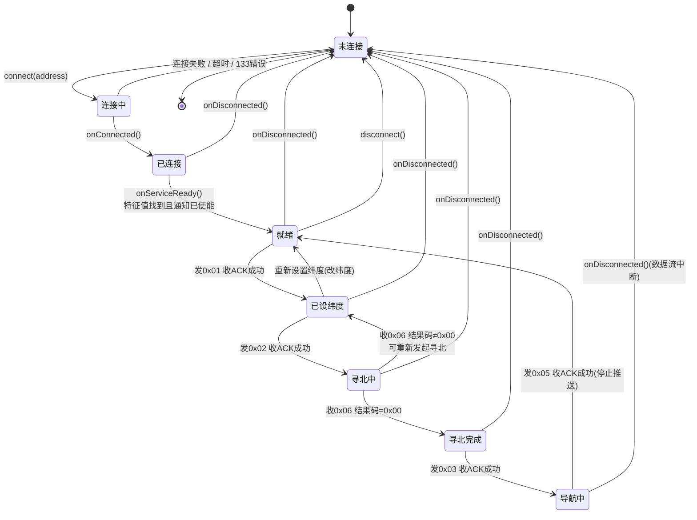
```mermaid
stateDiagram-v2
    [*] --> 未连接
    未连接 --> 连接中 : connect(address)
    连接中 --> 已连接 : onConnected()
    连接中 --> 未连接 : 连接失败 / 超时 / 133错误
    已连接 --> 就绪 : onServiceReady()<br/>特征值找到且通知已使能
    已连接 --> 未连接 : onDisconnected()
    就绪 --> 已设纬度 : 发0x01 收ACK成功
    就绪 --> 未连接 : onDisconnected()
    已设纬度 --> 寻北中 : 发0x02 收ACK成功
    已设纬度 --> 就绪 : 重新设置纬度(改纬度)
    已设纬度 --> 未连接 : onDisconnected()
    寻北中 --> 寻北完成 : 收0x06 结果码=0x00
    寻北中 --> 已设纬度 : 收0x06 结果码≠0x00<br/>可重新发起寻北
    寻北中 --> 未连接 : onDisconnected()
    寻北完成 --> 导航中 : 发0x03 收ACK成功
    寻北完成 --> 未连接 : onDisconnected()
    导航中 --> 就绪 : 发0x05 收ACK成功(停止推送)
    导航中 --> 未连接 : onDisconnected()(数据流中断)
    就绪 --> 未连接 : disconnect()
    未连接 --> [*]
```

**状态迁移约束**（固件与主机共同遵守）：

| 当前状态 | 允许的下一步 |
|---|---|
| 就绪 | 设置纬度、断开 |
| 已设纬度 | 寻北、重设纬度、断开 |
| 寻北中 | 等待 0x06 上报（期间不接受 0x02/0x03，固件可回 `0x02 状态错误`） |
| 寻北完成 | 进入导航、重新寻北、断开 |
| 导航中 | 退出导航、断开 |

### 2.2 连接层状态机（BluetoothLeService 内部）

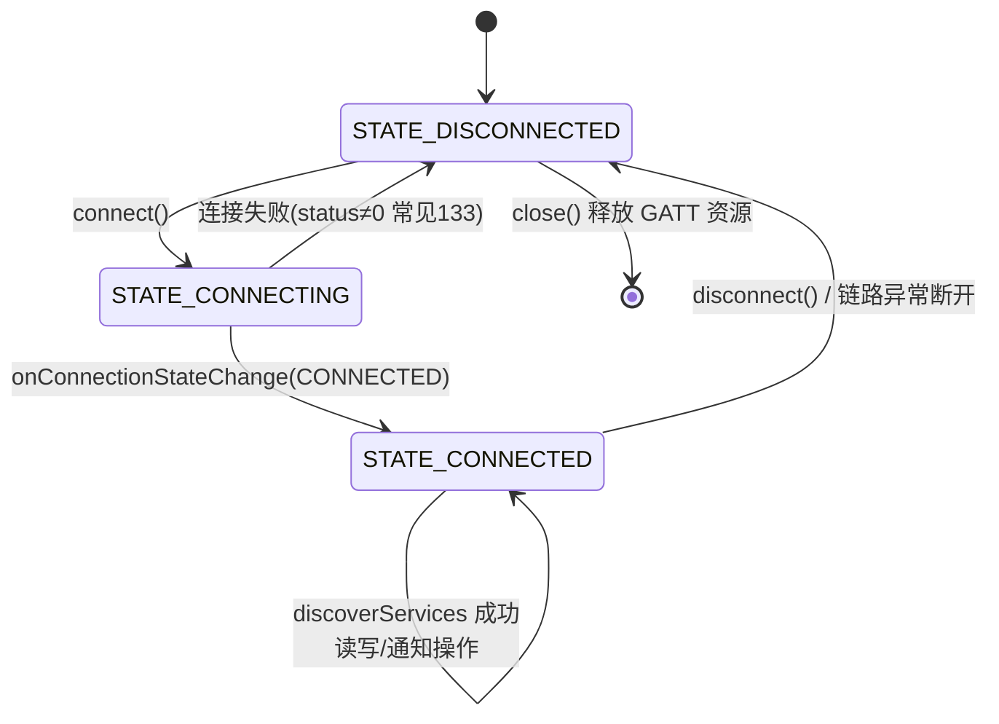
```mermaid
stateDiagram-v2
    [*] --> STATE_DISCONNECTED
    STATE_DISCONNECTED --> STATE_CONNECTING : connect()
    STATE_CONNECTING --> STATE_CONNECTED : onConnectionStateChange(CONNECTED)
    STATE_CONNECTING --> STATE_DISCONNECTED : 连接失败(status≠0 常见133)
    STATE_CONNECTED --> STATE_CONNECTED : discoverServices 成功<br/>读写/通知操作
    STATE_CONNECTED --> STATE_DISCONNECTED : disconnect() / 链路异常断开
    STATE_DISCONNECTED --> [*] : close() 释放 GATT 资源
```

### 2.3 协议解帧状态机（GyroProtocol.Parser）

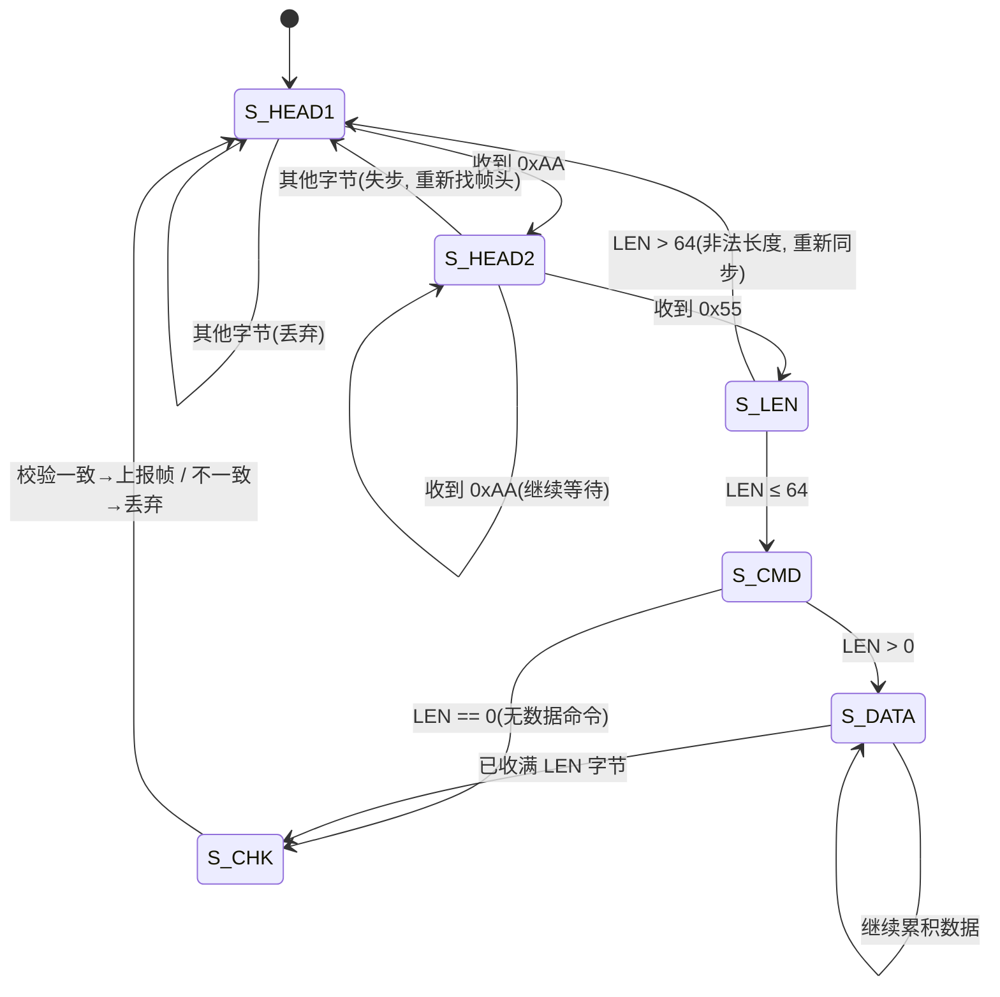
```mermaid
stateDiagram-v2
    [*] --> S_HEAD1
    S_HEAD1 --> S_HEAD2 : 收到 0xAA
    S_HEAD1 --> S_HEAD1 : 其他字节(丢弃)
    S_HEAD2 --> S_LEN : 收到 0x55
    S_HEAD2 --> S_HEAD2 : 收到 0xAA(继续等待)
    S_HEAD2 --> S_HEAD1 : 其他字节(失步, 重新找帧头)
    S_LEN --> S_CMD : LEN ≤ 64
    S_LEN --> S_HEAD1 : LEN > 64(非法长度, 重新同步)
    S_CMD --> S_DATA : LEN > 0
    S_CMD --> S_CHK : LEN == 0(无数据命令)
    S_DATA --> S_DATA : 继续累积数据
    S_DATA --> S_CHK : 已收满 LEN 字节
    S_CHK --> S_HEAD1 : 校验一致→上报帧 / 不一致→丢弃
```

> 关键点：该状态机天然处理 **半帧续接**（一个通知只有半帧，下个通知继续）与
> **粘包**（一个通知粘连多帧，逐帧解出）；数据域中出现 `AA 55` 不会误判为新帧头。

---

## 3. 异常处理流程

### 3.1 连接异常

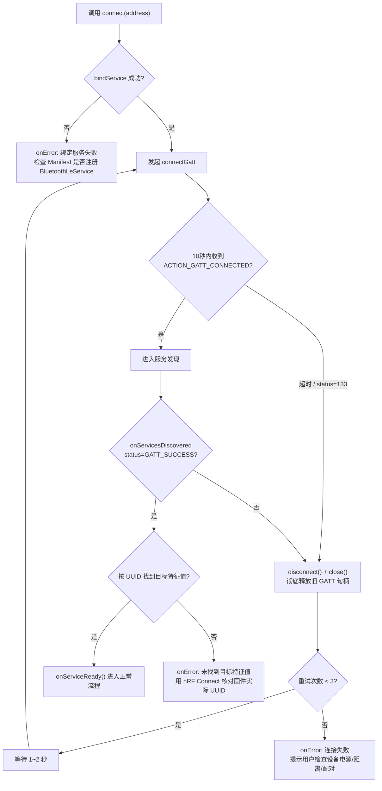
```mermaid
flowchart TD
    A["调用 connect(address)"] --> B{"bindService 成功?"}
    B -- 否 --> E1["onError: 绑定服务失败<br/>检查 Manifest 是否注册 BluetoothLeService"]
    B -- 是 --> C["发起 connectGatt"]
    C --> D{"10秒内收到<br/>ACTION_GATT_CONNECTED?"}
    D -- 是 --> F["进入服务发现"]
    D -- "超时 / status=133" --> G["disconnect() + close()<br/>彻底释放旧 GATT 句柄"]
    G --> H{"重试次数 < 3?"}
    H -- 是 --> I["等待 1~2 秒"]
    I --> C
    H -- 否 --> E2["onError: 连接失败<br/>提示用户检查设备电源/距离/配对"]
    F --> J{"onServicesDiscovered<br/>status=GATT_SUCCESS?"}
    J -- 否 --> G
    J -- 是 --> K{"按 UUID 找到目标特征值?"}
    K -- 是 --> L["onServiceReady() 进入正常流程"]
    K -- 否 --> E3["onError: 未找到目标特征值<br/>用 nRF Connect 核对固件实际 UUID"]
```

**要点**：
- `status=133`（GATT_ERROR）是最常见的连接异常，多因上次连接未正常 `close()` 或 GATT 操作过密；
  处理方式就是"彻底释放 → 延时 → 重试"，不要在旧句柄上反复重连；
- 连接超时建议主机侧自行计时（10 秒），Android 底层不保证连接失败及时回调。

### 3.2 发送异常（写失败 / 回调丢失）

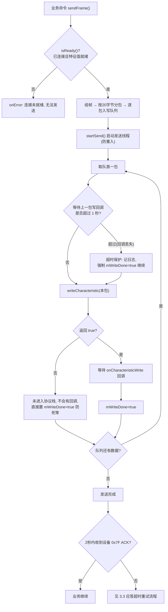
```mermaid
flowchart TD
    A["业务命令 sendFrame()"] --> B{"isReady()?<br/>已连接且特征值就绪"}
    B -- 否 --> E1["onError: 连接未就绪, 无法发送"]
    B -- 是 --> C["组帧 → 按20字节分包 → 逐包入写队列"]
    C --> D["startSend() 启动发送线程(防重入)"]
    D --> LOOP["取队首一包"]
    LOOP --> E{"等待上一包写回调<br/>是否超过 1 秒?"}
    E -- "超过(回调丢失)" --> F["超时保护: 记日志,<br/>强制 mWriteDone=true 继续"]
    E -- 否 --> G["writeCharacteristic(本包)"]
    F --> G
    G --> H{"返回 true?"}
    H -- 否 --> I["未进入协议栈, 不会有回调,<br/>直接置 mWriteDone=true 防死等"]
    H -- 是 --> J["等待 onCharacteristicWrite 回调"]
    J --> K["mWriteDone=true"]
    I --> L{"队列还有数据?"}
    K --> L
    L -- 是 --> LOOP
    L -- 否 --> M["发送完成"]
    M --> N{"2秒内收到设备 0x7F ACK?"}
    N -- 是 --> O["业务继续"]
    N -- 否 --> P["见 3.3 应答超时重试流程"]
```

**要点**：
- BLE 写操作必须**串行**：上一包回调到达前发下一包会导致静默丢包；
- 参考实现的三重保护：`mWriteDone` 串行标志 + 1 秒超时兜底 + `writeCharacteristic` 返回 `false` 的立即放行。

### 3.3 命令应答异常（超时与错误码）

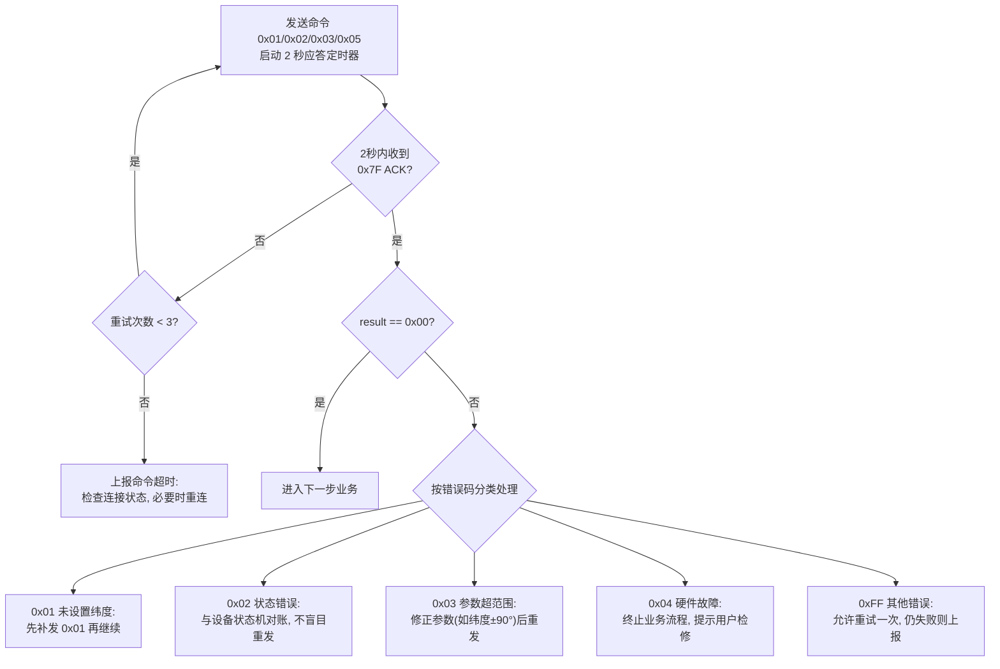
```mermaid
flowchart TD
    A["发送命令 0x01/0x02/0x03/0x05<br/>启动 2 秒应答定时器"] --> B{"2秒内收到<br/>0x7F ACK?"}
    B -- 否 --> C{"重试次数 < 3?"}
    C -- 是 --> A
    C -- 否 --> D["上报命令超时:<br/>检查连接状态, 必要时重连"]
    B -- 是 --> E{"result == 0x00?"}
    E -- 是 --> F["进入下一步业务"]
    E -- 否 --> G{"按错误码分类处理"}
    G --> G1["0x01 未设置纬度:<br/>先补发 0x01 再继续"]
    G --> G2["0x02 状态错误:<br/>与设备状态机对账, 不盲目重发"]
    G --> G3["0x03 参数超范围:<br/>修正参数(如纬度±90°)后重发"]
    G --> G4["0x04 硬件故障:<br/>终止业务流程, 提示用户检修"]
    G --> G5["0xFF 其他错误:<br/>允许重试一次, 仍失败则上报"]
```

### 3.4 寻北失败处理

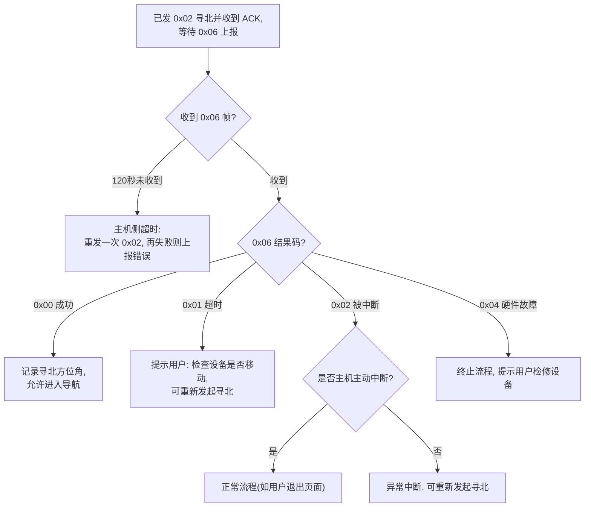
```mermaid
flowchart TD
    A["已发 0x02 寻北并收到 ACK,<br/>等待 0x06 上报"] --> B{"收到 0x06 帧?"}
    B -- "120秒未收到" --> T["主机侧超时:<br/>重发一次 0x02, 再失败则上报错误"]
    B -- 收到 --> C{"0x06 结果码?"}
    C -- "0x00 成功" --> D["记录寻北方位角,<br/>允许进入导航"]
    C -- "0x01 超时" --> E["提示用户: 检查设备是否移动,<br/>可重新发起寻北"]
    C -- "0x02 被中断" --> F{"是否主机主动中断?"}
    F -- 是 --> G["正常流程(如用户退出页面)"]
    F -- 否 --> H["异常中断, 可重新发起寻北"]
    C -- "0x04 硬件故障" --> I["终止流程, 提示用户检修设备"]
```

### 3.5 导航中断线恢复

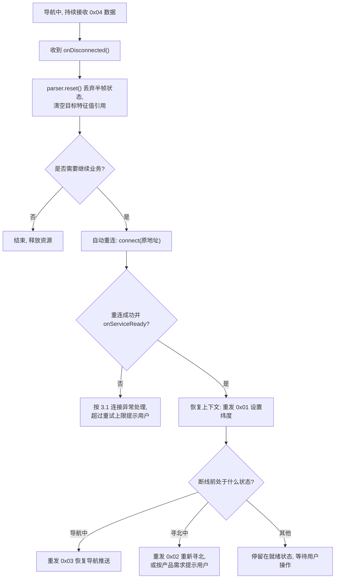
```mermaid
flowchart TD
    A["导航中, 持续接收 0x04 数据"] --> B["收到 onDisconnected()"]
    B --> C["parser.reset() 丢弃半帧状态,<br/>清空目标特征值引用"]
    C --> D{"是否需要继续业务?"}
    D -- 否 --> K["结束, 释放资源"]
    D -- 是 --> E["自动重连: connect(原地址)"]
    E --> F{"重连成功并 onServiceReady?"}
    F -- 否 --> G["按 3.1 连接异常处理,<br/>超过重试上限提示用户"]
    F -- 是 --> H["恢复上下文: 重发 0x01 设置纬度"]
    H --> I{"断线前处于什么状态?"}
    I -- "导航中" --> J1["重发 0x03 恢复导航推送"]
    I -- "寻北中" --> J2["重发 0x02 重新寻北,<br/>或按产品需求提示用户"]
    I -- "其他" --> J3["停留在就绪状态, 等待用户操作"]
```

### 3.6 接收与解帧异常

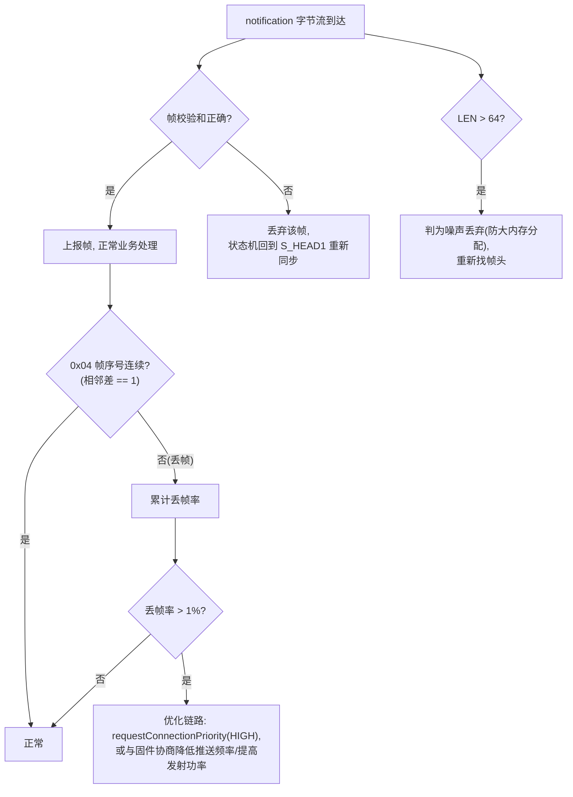
```mermaid
flowchart TD
    A["notification 字节流到达"] --> B{"帧校验和正确?"}
    B -- 是 --> C["上报帧, 正常业务处理"]
    B -- 否 --> D["丢弃该帧,<br/>状态机回到 S_HEAD1 重新同步"]
    A --> E{"LEN > 64?"}
    E -- 是 --> F["判为噪声丢弃(防大内存分配),<br/>重新找帧头"]
    C --> G{"0x04 帧序号连续?<br/>(相邻差 == 1)"}
    G -- 是 --> H["正常"]
    G -- "否(丢帧)" --> I["累计丢帧率"]
    I --> J{"丢帧率 > 1%?"}
    J -- 否 --> H
    J -- 是 --> K["优化链路: requestConnectionPriority(HIGH),<br/>或与固件协商降低推送频率/提高发射功率"]
```

### 3.7 异常分类汇总表

| 类别 | 典型现象 | 检测方式 | 处理策略 |
|---|---|---|---|
| 连接类 | 无法连接、status=133、连接后立刻断开 | 连接超时计时 / `onDisconnected` | 彻底释放 → 延时重试（≤3 次）→ 提示用户 |
| 服务类 | 找不到目标特征值 | `setupTargetCharacteristic` 遍历失败 | 提示 UUID 配置错误，用 nRF Connect 核对 |
| 发送类 | 设备收不到、收不全 | 写回调丢失（1s 超时）、ACK 超时 | 串行写 + 超时兜底 + ACK 重试（≤3 次） |
| 协议类 | 校验错误、LEN 非法、序号跳变 | 解析器状态机 / 帧序号 | 丢帧重同步；丢帧率高则优化连接参数 |
| 业务类 | 应答错误码 0x01~0xFF、寻北失败 | `onAck` / `onNorthSeekResult` | 按错误码分类处理（见 3.3 / 3.4） |
| 断线类 | 导航中链路断开 | `onDisconnected` | 复位解析器 → 重连 → 按断线前状态恢复业务 |
| 权限类 | 扫描无结果、连接被拒 | 权限检查 / `onScanFailed` | 补申请对应版本权限；Android 6~11 还需系统定位开关打开 |

---

## 4. 术语名词解释

### 4.1 BLE 基础

| 术语 | 英文/缩写 | 解释 |
|---|---|---|
| 低功耗蓝牙 | BLE (Bluetooth Low Energy) | 蓝牙 4.0 引入的低功耗通讯模式，适合传感器、模块类外设，本项目的通讯载体 |
| 中心设备 / 外设 | Central / Peripheral | BLE 角色：手机作为中心设备发起扫描和连接；陀螺仪模块作为外设广播并接受连接 |
| GATT | Generic Attribute Profile | BLE 数据通讯的通用属性协议框架，定义了服务/特征值的组织与读写方式 |
| ATT | Attribute Protocol | GATT 底层属性协议，MTU 概念即属于 ATT 层 |
| 属性 | Attribute | ATT 的基本数据单元，由**四部分**组成：Handle（16 位句柄，唯一标识）、Type（UUID，表明属性含义）、**Value（实际承载的数据，读写操作的对象）**、Permissions（服务端读/写访问规则，客户端不可直接读取）。一个 GATT Characteristic 就是一组 Attribute 的组合（Declaration + Value + 若干 Descriptor），代码中 `characteristic.getValue()/setValue()` 操作的正是 Attribute Value |
| 服务 | GATT Service | 外设上的一组功能的集合，由 128 位 UUID 标识（如本工程默认 `0000ffe0-...`） |
| 特征值 | Characteristic | 服务中实际承载数据读写的单元，有 UUID 与属性（读/写/通知等），如默认的 `0000ffe1-...` |
| 描述符 | Descriptor | 挂在特征值下的附加信息单元，最常用的是 CCCD |
| CCCD | Client Characteristic Configuration Descriptor | 固定 UUID `0x2902` 的描述符。主机向它写 `01 00` 才能使能通知（Notification），只调 `setCharacteristicNotification()` 而不写 CCCD，从机不会真正推送数据 |
| 通知 | Notification | 从机主动向主机推送数据的机制（无需应答），本项目的连续导航数据即用通知承载 |
| 指示 | Indication | 类似通知但从机需要收到主机确认，吞吐更低，本项目未使用 |
| MTU | Maximum Transmission Unit | ATT 层单包最大字节数，默认 23（数据载荷仅 20 字节）；可通过 `requestMtu()` 协商更大值（载荷 = MTU − 3） |
| 连接间隔 | Connection Interval | 主从设备两次通讯事件的时间间隔，越短延迟越低、功耗越高；高频数据可用 `requestConnectionPriority(HIGH)` 请求缩短 |
| RSSI | Received Signal Strength Indicator | 接收信号强度（dBm，负值），可用于粗略估计设备距离、辅助选择目标设备 |
| 广播包 | Advertisement | 外设周期性发出的广播数据，含设备名、服务 UUID 等，主机据此扫描发现设备 |
| GATT_ERROR (133) | status=133 | Android 上最常见的 GATT 错误码，泛指连接/操作异常，常见诱因：旧连接未 `close()`、操作过快、未指定 `TRANSPORT_LE` |
| TRANSPORT_LE | — | `connectGatt` 的传输类型参数，强制走 BLE 传输，避免个别手机误走经典蓝牙通道（API 23+ 可用） |

### 4.2 协议与数据链路

| 术语 | 解释 |
|---|---|
| 帧 (Frame) | 协议层的数据传输单元。本项目帧格式：`帧头(0xAA 0x55) + 长度 + 命令 + 数据域 + 校验和` |
| 组帧 / 解帧 | 把业务参数按帧格式编码成字节流 / 从字节流还原出命令与数据的过程 |
| 校验和 (CHK) | 本项目采用模 256 累加和：`(LEN + CMD + DATA 各字节) & 0xFF`，用于检错 |
| 大端 (Big-Endian) | 多字节数的高字节存放在低地址（先发送）。本项目所有多字节字段统一大端 |
| 粘包 | 多个协议帧被合并到一次 notification 中到达，解析器需逐帧切分 |
| 半帧 / 断帧 | 一个协议帧被拆到多次 notification 中到达，解析器需跨包累积续接 |
| 重新同步 (Resync) | 校验失败或长度非法时，解析器丢弃当前数据、回到"找帧头"状态等待下一帧的能力 |
| 状态机 | 用有限个状态与迁移规则描述解析/业务过程的方法。本项目有两处：解帧状态机（6 态）与主机业务状态机 |
| ACK / 通用应答 | 设备对主机命令的确认帧（本项目命令 `0x7F`），携带被应答命令与结果码，是超时重试机制的依据 |
| 帧序号 | 导航数据帧中的 0~255 滚动计数，主机据此检测丢帧、统计丢帧率 |
| 状态字 | 导航数据帧中的一字节位图（bit0 寻北完成、bit1 导航有效、bit2 自检通过、bit3 纬度已设置） |
| 串行写 | BLE 的写操作必须"发一包 → 等写完成回调 → 再发下一包"，并发写入会导致静默丢包 |
| 写类型 | `WRITE`（有应答，可靠）与 `WRITE_NO_RESPONSE`（无应答，低延迟），需与特征值属性、固件实现一致 |

### 4.3 陀螺仪业务

| 术语 | 解释 |
|---|---|
| 纬度 | 设备所在地理纬度（北纬为正、南纬为负）。寻北算法需要纬度来补偿地球自转角速度的水平分量，因此是寻北的前置参数 |
| 寻北 | 利用陀螺仪敏感地球自转分量，解算出真北方向的过程，耗时通常为数十秒量级，期间设备必须保持静止 |
| 寻北方位角 | 寻北解算得到的设备参考轴相对真北的水平夹角 |
| 航向角 (Heading / Yaw) | 设备绕垂直轴的指向角，范围 0~359.99°，导航数据的核心输出 |
| 俯仰角 (Pitch) | 设备绕横轴的上仰/下俯角，范围 ±90° |
| 横滚角 (Roll) | 设备绕纵轴的左右倾斜角，范围 ±180° |
| 导航（连续导航数据） | 设备进入导航模式后按固定周期（10~50 Hz）输出航向/俯仰/横滚等姿态数据的过程 |

### 4.4 Android 平台

| 术语 | 解释 |
|---|---|
| API 等级 | Android 系统版本号对应的数字（如 API 23=Android 6.0，31=Android 12，33=Android 13，34=Android 14），决定可用 API 与权限模型 |
| 运行时权限 | Android 6.0+ 的危险权限需在使用前动态申请；BLE 扫描/连接相关权限随版本演进（见下表） |
| `BLUETOOTH_SCAN` / `BLUETOOTH_CONNECT` | Android 12+ 新增的扫描/连接权限，替代旧 `BLUETOOTH`/`BLUETOOTH_ADMIN` + 定位权限的组合 |
| `neverForLocation` | 在 `BLUETOOTH_SCAN` 上声明的标志：声明扫描结果不用于定位，从而免除定位权限 |
| `ACCESS_FINE_LOCATION` | Android 6~11 扫描 BLE 所需的定位权限，且要求系统"位置信息"开关打开 |
| Service（Android 组件） | 后台运行组件。本项目 `BluetoothLeService` 用 Bound Service 形式承载 GATT 连接，使连接不随 Activity 销毁而中断 |
| 广播 (Broadcast) | 进程内/进程间事件通知机制。`BluetoothLeService` 通过发送广播把 GATT 事件传递给业务层（也可替换为直接回调） |
| `RECEIVER_NOT_EXPORTED` | Android 13+ 动态注册广播接收器时必须声明的标志之一，表示仅接收本应用内部广播（参考实现已按版本适配） |

**各 Android 版本 BLE 权限速查**：

| Android 版本 | API | 扫描所需 | 连接所需 |
|---|---|---|---|
| 4.3 ~ 5.1 | 18~22 | `BLUETOOTH` + `BLUETOOTH_ADMIN`（安装时授予） | 同左 |
| 6.0 ~ 11 | 23~30 | 上述 + `ACCESS_FINE_LOCATION`（运行时）+ 系统定位开关 | `BLUETOOTH` + `BLUETOOTH_ADMIN` |
| 12+ | 31+ | `BLUETOOTH_SCAN`（运行时；声明 `neverForLocation` 可免定位） | `BLUETOOTH_CONNECT`（运行时） |

---

*本文档与《BLE提取与陀螺仪自定义协议指导文档》及 `docs/reference/` 参考实现配套使用；
分支 `arena/01a09ff4-ble-tool`。*
