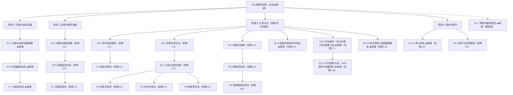
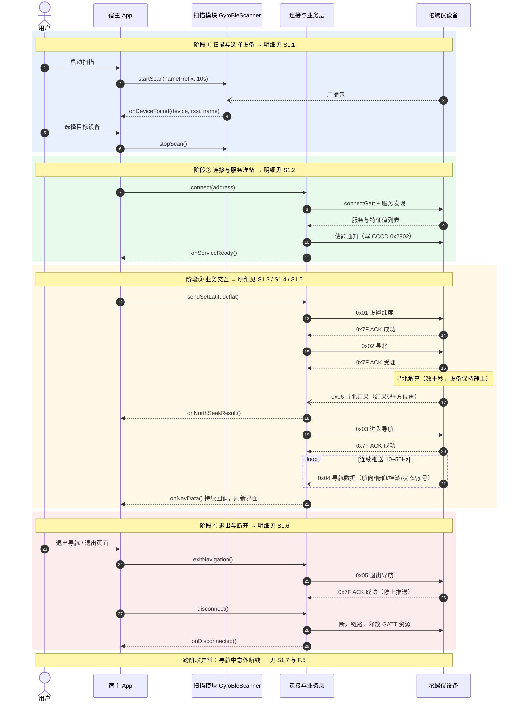
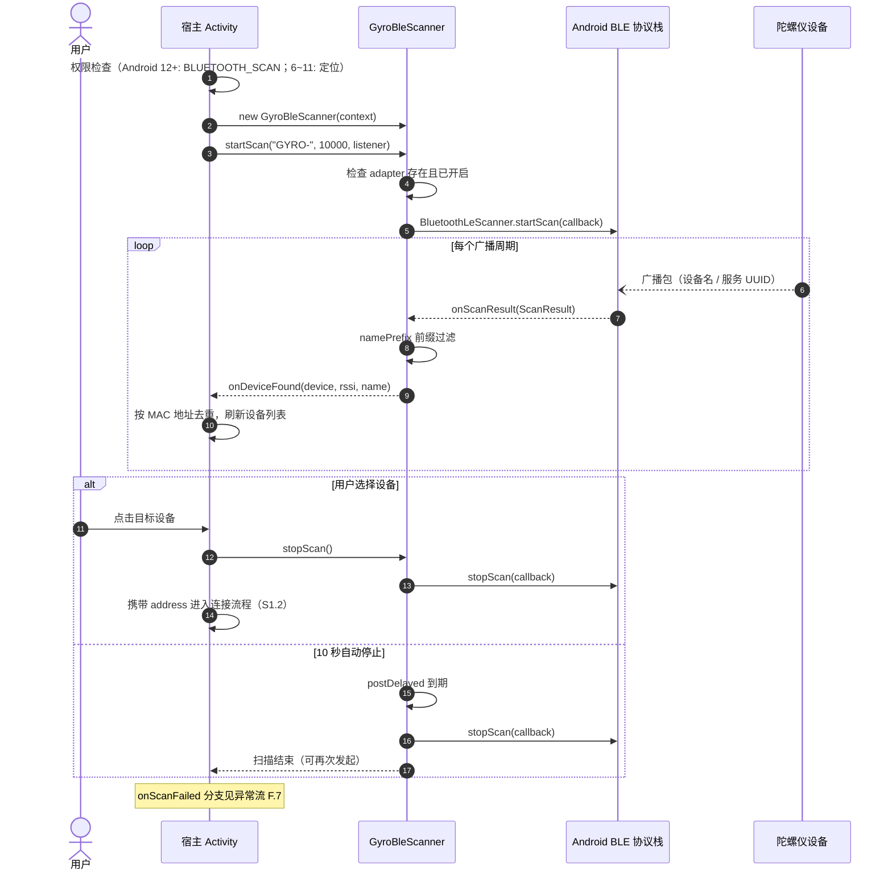
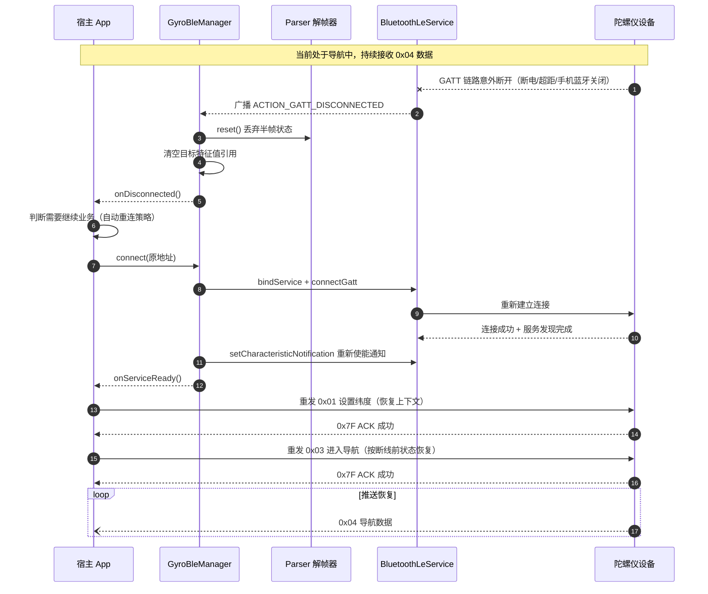
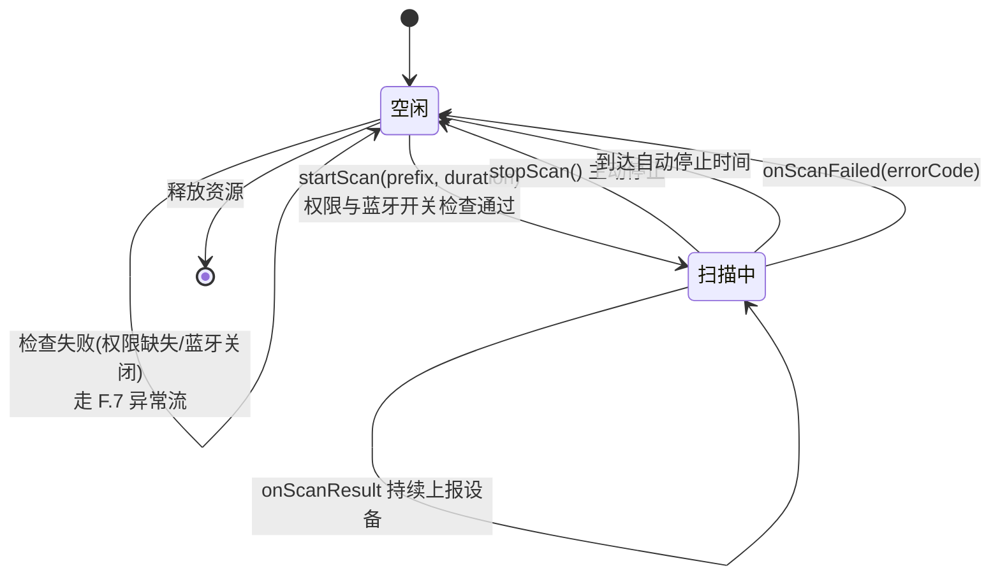
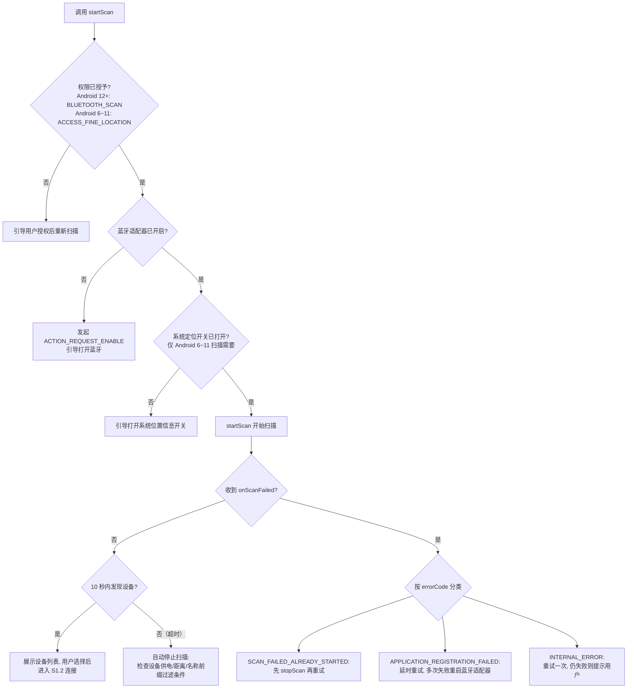

# BLE 图层级总览与查漏补缺（L0 顶层时序图）

> 本卷是前两卷的**层级化总览与完整性补充**：
> - 《BLE提取与陀螺仪自定义协议指导文档》——协议规格与移植指南
> - 《BLE协议时序图_状态图_异常处理与术语表》——5 个时序图、3 个状态图、6 个异常流、术语表
>
> 本卷内容：
> 1. 给出覆盖前卷 5 个时序图的 **L0 顶层时序图**；
> 2. 将全部图按 **L0→L1→L2→L3** 层级对齐，逐层检查缺口；
> 3. 补齐 4 个缺口图：**S1.1 扫描时序图、S1.7 断线恢复时序图、ST.4 扫描器状态图、F.7 扫描异常流程图**。

---

## 目录

1. [图层级架构](#1-图层级架构)
2. [L0 顶层时序图（S0）](#2-l0-顶层时序图s0)
3. [L1 明细时序图：对齐与查漏补缺](#3-l1-明细时序图对齐与查漏补缺)
4. [L2 状态图：对齐与查漏补缺](#4-l2-状态图对齐与查漏补缺)
5. [L3 异常流：对齐与查漏补缺](#5-l3-异常流对齐与查漏补缺)
6. [查漏补缺总结](#6-查漏补缺总结)

---

## 1. 图层级架构

### 1.1 层级约定

| 层级 | 含义 | 图类型 | 编号规则 |
|---|---|---|---|
| **L0** | 全生命周期顶层视图，只呈现阶段与阶段间的关键交互 | 时序图 | `S0` |
| **L1** | 单一阶段的明细时序（S0 的逐级下钻） | 时序图 | `S1.1 ~ S1.7` |
| **L2** | 支撑 L1 的状态机视角（对象状态如何随事件迁移） | 状态图 | `ST.1 ~ ST.4` |
| **L3** | 异常分支视角（正常流之外的检测与处理） | 流程图 | `F.1 ~ F.7` |

### 1.2 层级树

### 1.3 图索引与出处对照表

| 编号 | 图名 | 层级 | 位置 | 状态 |
|---|---|---|---|---|
| S0 | 顶层时序图（全生命周期） | L0 | **本卷 §2** | ★新增 |
| S1.1 | 扫描与选择设备明细 | L1 | **本卷 §3.2** | ★新增（补缺） |
| S1.2 | 连接与服务准备 | L1 | 前卷 §1.1 | 已有 |
| S1.3 | 命令发送管线（以寻北为例） | L1 | 前卷 §1.2 | 已有 |
| S1.4 | 完整业务交互 | L1 | 前卷 §1.3 | 已有 |
| S1.5 | 接收与解帧 | L1 | 前卷 §1.4 | 已有 |
| S1.8 | 连接后设置纬度操作（单命令完整往返） | L1 | 前卷 §1.6 | ★新增 |
| S1.9 | 连接后寻北操作（命令应答 + 异步结果上报） | L1 | 前卷 §1.7 | ★新增 |
| S1.10 | 启动导航操作（进入导航 + 连续数据接收，含激活条） | L1 | 前卷 §1.8 | ★新增 |
| S1.11 | 停止导航操作（退出导航，含激活条） | L1 | 前卷 §1.9 | ★新增 |
| S1.12 | 寻北操作超时分支（ACK 超时重发 + 寻北结果超时，含激活条） | L1 | 前卷 §1.10 | ★新增 |
| S1.6 | 断开与资源释放 | L1 | 前卷 §1.5 | 已有 |
| S1.7 | 导航中断线恢复 | L1 | **本卷 §3.3** | ★新增（补缺） |
| ST.1 | 主机业务状态机 | L2 | 前卷 §2.1 | 已有 |
| ST.2 | 连接层状态机 | L2 | 前卷 §2.2 | 已有 |
| ST.3 | 协议解帧状态机 | L2 | 前卷 §2.3 | 已有 |
| ST.4 | 扫描器状态机 | L2 | **本卷 §4.2** | ★新增（补缺） |
| F.1~F.6 | 连接/发送/应答/寻北/断线/解帧异常流 | L3 | 前卷 §3.1~3.6 | 已有 |
| F.7 | 扫描异常流 | L3 | **本卷 §5.2** | ★新增（补缺） |

---

## 2. L0 顶层时序图（S0）

覆盖从"启动扫描"到"断开释放"的完整生命周期；每个阶段标注了对应的 L1 明细图编号。
为保持顶层简洁，本图将 `GyroBleManager` 与 `BluetoothLeService` 折叠为"连接与业务层"，
L1 图中再展开两者之间的绑定/广播细节。

**阅读指引**：

| S0 阶段 | 下钻明细（L1） | 关注点 |
|---|---|---|
| ① 扫描与选择设备 | S1.1 | 权限前置检查、名称前缀过滤、超时自停 |
| ② 连接与服务准备 | S1.2 | 绑定服务、服务发现、CCCD 使能、300ms 延时 |
| ③ 业务交互 | S1.3 发送管线 / S1.4 业务帧流 / S1.5 接收解帧 | 串行写、ACK 确认、流式解帧 |
| ④ 退出与断开 | S1.6 | `close()` 释放，防泄漏 |
| 跨阶段断线 | S1.7 | 复位解析器、重连、业务恢复 |

---

## 3. L1 明细时序图：对齐与查漏补缺

### 3.1 对齐检查表

| S0 阶段 | 需要的明细 | 现状 | 结论 |
|---|---|---|---|
| ① 扫描与选择设备 | 扫描启动/过滤/停止时序 | 前卷 5 图均从 `connect()` 开始，**扫描无时序图** | ❌ 缺口 → 本卷新增 S1.1 |
| ② 连接与服务准备 | 有 | 前卷 §1.1（本卷编号 S1.2） | ✅ 对齐 |
| ③ 业务交互—发送 | 有 | 前卷 §1.2（S1.3） | ✅ 对齐 |
| ③ 业务交互—帧流 | 有 | 前卷 §1.3（S1.4） | ✅ 对齐 |
| ③ 业务交互—接收 | 有 | 前卷 §1.4（S1.5） | ✅ 对齐 |
| ④ 退出与断开 | 有 | 前卷 §1.5（S1.6） | ✅ 对齐 |
| 跨阶段—断线恢复 | 异常流 F.5 仅有流程图，无时序图 | ❌ 缺口 → 本卷新增 S1.7 |

### 3.2 S1.1 扫描与选择设备明细（★新增）

覆盖 S0 阶段①：权限检查 → 启动扫描 → 广播过滤 → 用户选择 → 停止扫描进入连接。

### 3.3 S1.7 导航中断线恢复（★新增）

覆盖跨阶段异常：导航中链路意外断开 → 自动重连 → 业务上下文恢复。
此图是异常流 F.5（前卷 §3.5）的时序版，两者描述同一流程的不同视角。

---

## 4. L2 状态图：对齐与查漏补缺

### 4.1 对齐检查表

| 生命周期对象 | 状态机 | 触发它的事件来自哪个 L1 图 | 现状 |
|---|---|---|---|
| 主机业务（全局） | ST.1 主机业务状态机 | S1.2（连接/就绪）、S1.4（命令与上报）、S1.6/S1.7（断开） | ✅ 已有 |
| GATT 连接 | ST.2 连接层状态机 | S1.2、S1.6、S1.7 | ✅ 已有 |
| 接收字节流 | ST.3 解帧状态机 | S1.5 | ✅ 已有 |
| 扫描器 | **无状态机** | S1.1 | ❌ 缺口 → 本卷新增 ST.4 |

### 4.2 ST.4 扫描器状态机（★新增）

### 4.3 ST.1 主机业务状态机：迁移事件对齐核对

逐条核对每个状态迁移是否都能在某张时序图中找到触发事件（确保状态图与行为图一致）：

| 状态迁移 | 触发事件 | 事件出现于 | 核对 |
|---|---|---|---|
| 未连接 → 连接中 | `connect(address)` | S1.2 步骤"bindService/connectGatt" | ✅ |
| 连接中 → 已连接 | `onConnected()` 广播 | S1.2 | ✅ |
| 连接中 → 未连接 | 连接失败/超时/133 | F.1 异常流 | ✅ |
| 已连接 → 就绪 | `onServiceReady()` | S1.2 | ✅ |
| 就绪 → 已设纬度 | 0x01 + ACK(0x00) | S0 阶段③、S1.4 | ✅ |
| 已设纬度 → 寻北中 | 0x02 + ACK(0x00) | S1.4 | ✅ |
| 寻北中 → 寻北完成 | 0x06 结果码 0x00 | S1.4 | ✅ |
| 寻北中 → 已设纬度 | 0x06 结果码 ≠ 0x00 | F.4 异常流 | ✅ |
| 寻北完成 → 导航中 | 0x03 + ACK(0x00) | S0 阶段③、S1.4 | ✅ |
| 导航中 → 就绪 | 0x05 + ACK(0x00) | S0 阶段④、S1.6 | ✅ |
| 任意 → 未连接 | `onDisconnected()` | S1.6、S1.7 | ✅ |

**核对结论**：ST.1 的全部 11 条迁移均有对应行为图支撑，无悬空迁移。

---

## 5. L3 异常流：对齐与查漏补缺

### 5.1 对齐检查表

| 异常类别 | 检测点（出现于哪个时序图） | 处理流程图 | 现状 |
|---|---|---|---|
| 扫描失败/无结果 | S1.1（`onScanFailed`/超时） | **无** | ❌ 缺口 → 本卷新增 F.7 |
| 连接失败/133/服务发现失败 | S1.2 | F.1（前卷 §3.1） | ✅ |
| 写失败/回调丢失 | S1.3 | F.2（前卷 §3.2） | ✅ |
| 命令应答超时/错误码 | S1.4 | F.3（前卷 §3.3） | ✅ |
| 寻北失败 | S1.4（0x06 分支）、S1.12（超时分支） | F.4（前卷 §3.4） | ✅ |
| 导航中断线 | S1.7 | F.5（前卷 §3.5） | ✅（本卷补齐时序版） |
| 校验错误/丢帧 | S1.5 | F.6（前卷 §3.6） | ✅ |

### 5.2 F.7 扫描异常流（★新增）

---

## 6. 查漏补缺总结

本次层级对齐共检查 **4 个层级、18 张图位**，发现并补齐 4 处缺口：

| # | 缺口 | 层级 | 补齐方式 | 对应参考实现 |
|---|---|---|---|---|
| 1 | 扫描阶段无时序图（前卷 5 图均从 `connect()` 开始） | L1 | 新增 **S1.1** 扫描与选择设备明细 | `GyroBleScanner.startScan/stopScan` |
| 2 | 断线恢复只有异常流程图（F.5），无时序视角 | L1 | 新增 **S1.7** 导航中断线恢复时序图 | `GyroBleManager.disconnect/connect` 重连 + `parser.reset()` |
| 3 | 扫描器对象无状态机 | L2 | 新增 **ST.4** 扫描器状态机 | `GyroBleScanner.scanning` 标志 |
| 4 | 扫描失败无异常处理流程 | L3 | 新增 **F.7** 扫描异常流 | 权限检查 + `onScanFailed` 错误码分类 |

同时对齐核对结论：

- **S0 ↔ L1**：顶层 4 个阶段 + 1 个跨阶段异常全部有明细图支撑；
- **L1 ↔ L2**：ST.1 主机业务状态机的 11 条迁移逐条核对，均有触发事件来源，无悬空迁移；
- **L1 ↔ L3**：7 类异常均有"时序图中的检测点 + 流程图中的处理策略"双重覆盖；
- 术语与帧格式仍以前两卷为准，本卷未引入新的协议内容。

---

*本卷与前两卷及 `docs/reference/` 参考实现配套使用；分支 `arena/01a09ff4-ble-tool`。*
